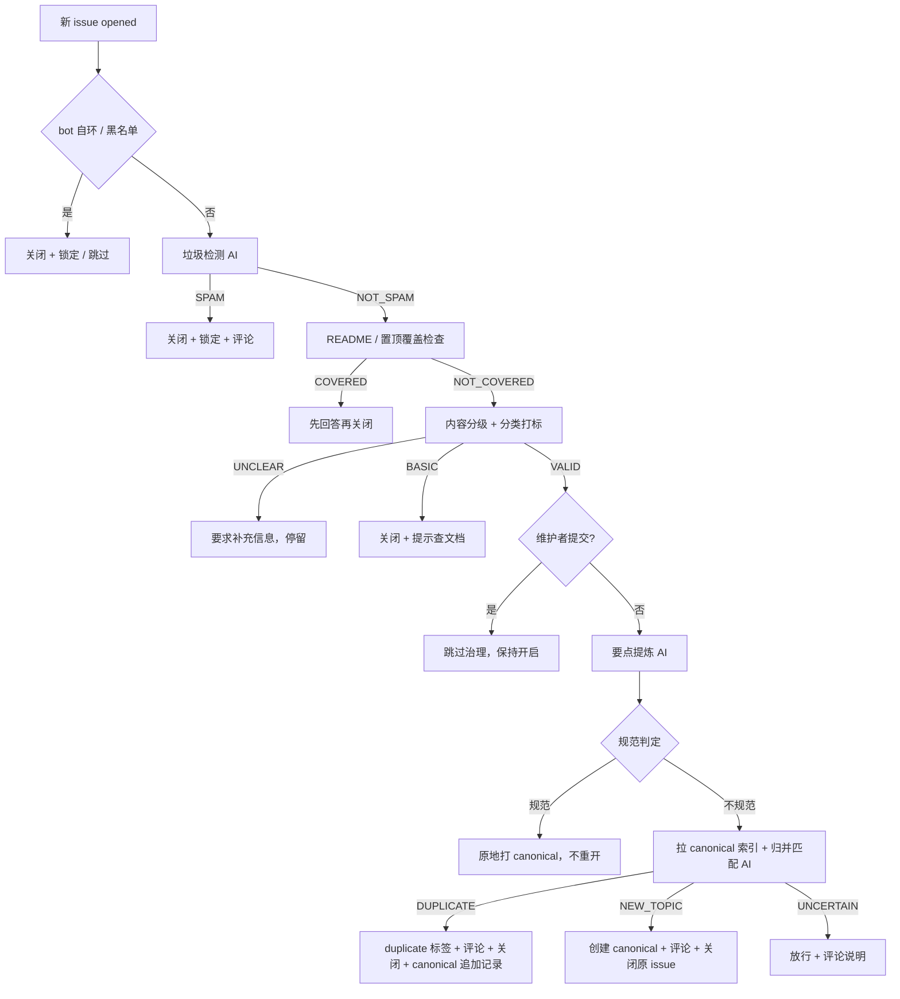

# AI Issue Governance

GitHub Action：把 NoMore Spam 改造成面向本仓库（workbuddy2api）的 **AI Issue 治理** action——
在保留上游「垃圾检测 / README 覆盖 / 内容分级」能力的基础上，新增**要点提炼 + canonical 归并 + 规范化重开**。

> 上游：<https://github.com/JohnsonRan/nomore-spam>（MIT，本目录 `LICENSE` 保留其版权声明）。
> 本目录代码为本地 composite action（`uses: ./.github/actions/ai-governance`），不是发布到 Marketplace 的第三方 action。

## 它解决什么问题

用户提的 issue 普遍不规范：描述混乱、一条 issue 混多个诉求、重复提需求。Issue Forms 模板挡不住低质量内容。本 action 做的事：

1. **垃圾检测**（保留上游）：SPAM → 关闭 + 锁定 + 评论说明。
2. **要点提炼**：AI 抽出「要点 + 要做的事」，中文结构化摘要。
3. **归并匹配**：拉取带 `canonical` 标签的 issue 列表造索引（编号 + 标题 + 正文摘要），AI 判断新 issue 是否与某条 canonical 重复/高度相关。
   - 匹配成功 → 新 issue 评论（要点 + canonical 链接）+ `duplicate` 标签 + 关闭，并向 canonical 追加「归并记录」。
   - 无匹配 → AI 生成规范化新 issue（`[Feature]`/`[Bug]` 前缀 + 背景与要点 + 期望行为），创建并打 `canonical` + 分类标签，原 issue 评论 + 关闭。
4. **质量分级边界**：已规范的 issue 不重开，原地打 `canonical`。
5. **PR 治理**：默认关闭（`enable-pr-governance: true`）。开启后 PR 打开时走同一套「整理 + 关联」：
   - 保留上游垃圾 / 质量检测（SPAM/恶意/trivial → 关闭，这是**唯一会关 PR 的路径**）；标题不规范的 PR
     （`INVALID_COMMIT`）不再关闭，而是流入治理「规范化改写标题」；
   - AI 提炼 PR 要点 → 匹配 canonical（复用 issue 治理的提炼/匹配/起草）→ 评论 + 规范化标题 + 正文顶部追加关联块；
   - 匹配成功关联 `Related to #N`；无匹配则创建新 canonical，正文追加 `Closes #N`；
   - **PR 治理永不关闭合法 PR**，正文追加带幂等锚点（`<!-- ai-governance:linked -->`）防重跑叠加。
6. **PR 历史语境评审**（`pr-review-close`，默认关闭）：开启后，在垃圾检测与维护者豁免之后、canonical 关联之前，
   增加 AI 对照「历史结论」的评审层：
   - **取数（脚本负责，AI 无网络）**：PR 自身（标题/正文/文件变更/提交列表）+ 相关历史 issue
     （canonical 标签检索 + 标题关键词文本检索已关闭 issue，双通道去重）→ 每条相关 issue 读全文 +
     全部评论 + 事件时间线，还原「它为什么被关」（merged / wontfix / duplicate / 维护者在评论里给的理由），
     压缩成结构化语境包（截断规则复用 `canonical-body-truncate` 口径）；
   - **判定（AI）**：PR 是否与历史结论冲突——重复做了已合并的工作？撞上 wontfix/duplicate 的关闭理由？
     评审判定返回 `CLOSE / KEEP / UNCERTAIN` + 证据条目（必须引用真实 issue 编号）；
   - **执行**：判 `CLOSE` 且证据通过确定性校验（AI 引用的编号必须真实存在于语境包，防幻觉引用）→
     生成中文评审评论（🤖 前缀 + 「✅ 机器人操作日志」行，先评论后关闭）→ **关闭 PR，不创建任何 canonical**；
     关闭失败容忍留痕；
   - **安全阀（宁可漏判、不可误关）**：无相关历史 issue / 判 `KEEP` / 判 `UNCERTAIN` / 证据引用了不存在的
     issue / 评审评论草稿失败 / 检索故障 → 一律回落旧的 canonical 关联链路，绝不误关。
   - 配置项：`pr-review-close`（开关，默认 `false`——会关 PR 的新能力必须显式开启）、`max-related-issues`、
     `related-comments-per-issue`、`related-body-truncate`。
7. **治理身份（`governance-token`）**：无需配置任何 PAT。workflow 里的 `claude-identity` 换票步骤用 runner
   的 OIDC token（`id-token: write`）向 Anthropic 换来 Claude GitHub App 的 installation token，传入本输入后，
   所有治理写操作（评论/关闭/打标/建 issue）以 **claude[bot]** 身份发布。换票失败时回落 `github.token`
   （github-actions[bot]），治理不中断。
8. **统一历史语境层（F1）**：`historyContextService` 是「取回并组织仓库历史 issue 与 PR 作为参考经验」的唯一入口：
   - `buildIndex`：紧凑索引（每条一行，编号/类型/标题/标签/状态/关闭理由，上限 `max-history-index` 默认 100），
     双通道并集去重——search API 全量 issue+PR（不分状态，历史 PR 也是参考经验）∪ canonical 标签列表（保证入选）；
   - `enrich`：为筛出的候选深补全——正文（截断）+ 评论（每条截断 500）+ 时间线（白名单过滤）；PR 额外含
     文件变更摘要与提交列表。单条失败跳过（容忍语义），全失败返回空、调用方回落旧行为；
   - 每次治理运行只拉一次索引，评审与关联层共享（`ctx` 传递）。
9. **两段式 AI 流水线（F2，`enable-two-stage`，默认关闭）**：开启后「先廉价筛选、再深加工」：
   - **阶段一（筛选）**：廉价筛选 AI 只看主题元信息 + 紧凑索引（永远不喂正文全文/评论/时间线），
     选出候选编号；确定性闸门剔除幻觉编号（number+kind 必须命中索引），空/失败回落关键词启发式（绝不硬失败）；
     可用 `screening-model` 配更廉价的模型；
   - **阶段二（深加工）**：只看筛出候选的深补全材料。三类消费者——PR 历史语境评审（语料扩展到历史 PR，
     C10）、canonical 归并匹配（候选含评论历史，R9）、规范 issue 评审评论（`related_history` 输入段，
     空数组时提示词要求不引用任何编号，防幻觉）；
   - **确定性防线**：评审证据闸门加固（R13）——逐行校验引用真实性，≥2 条有效行，或单行且与被引条目的
     结论关键词（wontfix/not_planned/duplicate/completed/merged，同义归并）确定性重叠；归并匹配
     DUPLICATE(#N) 的 N 必须在候选语料里，否则降级 UNCERTAIN 放行；两类 AI 起草的公开评论
     均过引用校验（草稿引用语境集合外编号 → 整条作废回落固定模板/旧链路）；
   - **上线纪律**：默认 `false` 暗发；dry-run 观察期后仅由 owner 在 workflow yml 翻转（与
     `pr-review-close` 同纪律）。
10. **评审关闭的确定性标记（R6）**：历史语境评审关闭的 PR 在关闭前先打 `history-rejected` 标签
    （PR 不支持 `state_reason`，标签是唯一可查的关闭理由标记，供历史检索与未来筛选阶段做语料信号）；
    失败容忍，不阻断评论与关闭。引用了真实历史的评审评论尾部由服务端确定性追加
    「以上引用的历史条目见各编号原帖。」指引行（不依赖模型自觉）。
11. **提交规范确定性校验（R11）**：PR 标题的 INVALID_COMMIT 判定改用确定性 Conventional Commits 正则
    （与治理层标题改写同口径），去掉此前这一次 AI 调用——每个 PR 省 1 次 AI 调用；AI 只保留给
    「起草新标题」。

> **R12 成本决策（2026-09）**：`analyze-file-changes` 三处默认值（action.yml / config.json / workflow）
> 统一为 `true`。diff 是垃圾/质量检测与历史语境评审的核心证据（MALICIOUS/TRIVIAL 对标题+正文的判读
> 近乎盲猜），成本可接受。若后续成本敏感，可只在 `pr-review-close: true` 时启用。

## 安全阀（设计要点）

| 安全阀 | 行为 |
|--------|------|
| **dry-run** | 默认 `true`：只评论「本应执行什么」，不关闭、不创建、不打标签 |
| **维护者豁免** | 仓库协作者提交的 issue/PR 跳过治理（只做垃圾检测 + 分类） |
| **AI 失败不误关** | 任何 AI 调用失败 → 只评论「已放行」+ 保持开启；**宁可漏判，不可误关** |
| **先建后关** | 新主题时先创建 canonical，成功后才关闭原 issue；创建失败绝不关闭 |
| **UNCERTAIN 放行** | 归并匹配证据不足时放行，仅评论，由维护者人工判断 |
| **bot 自环防护** | 跳过 `github-actions[bot]` 自身 issue/PR，避免治理自己创建的 canonical 造成死循环 |
| **PR 永不因治理被关** | PR 治理只评论/改写标题/追加正文，唯一关闭出口是上游垃圾/恶意/trivial 检测 |
| **历史语境评审安全阀** | 无历史语境 / KEEP / UNCERTAIN / 证据编号未通过真实性校验 → 回落旧关联链路，绝不误关 |
| **防幻觉证据闸门** | AI 判 CLOSE 时，证据必须引用语境包中真实存在的 issue 编号，否则视为证据不足回落 |

## 使用

### 1. workflow 示例

`.github/workflows/ai-governance.yml`（本仓库已提供）：

```yaml
name: AI Governance

on:
  issues:
    types: [opened]
  # PR 治理：pull_request_target 让 action 以目标仓库身份运行，获得改写 PR 标题/正文的写权限
  # （安全设计见 DESIGN.md §12：本地 action、不 checkout fork 分支、token 不外泄）
  pull_request_target:
    types: [opened]

permissions:
  contents: read
  issues: write
  pull-requests: write     # PR 治理改写标题 / 追加正文需要
  models: read             # 仅走 GitHub Models 时需要

jobs:
  governance:
    runs-on: ubuntu-latest
    permissions:
      id-token: write
    steps:
      - uses: actions/checkout@v4
      # claude[bot] 身份：runner OIDC → Anthropic 换票（无需任何 PAT/secret）
      - name: Exchange OIDC for Claude App token
        id: claude-identity
        run: |
          OIDC=$(curl -sf -H "Authorization: bearer $ACTIONS_ID_TOKEN_REQUEST_TOKEN" \
            "$ACTIONS_ID_TOKEN_REQUEST_URL&audience=claude-code-github-action" | jq -r .value)
          APP_TOKEN=$(curl -sf -X POST \
            -H "Authorization: Bearer $OIDC" \
            https://api.anthropic.com/api/github/github-app-token-exchange \
            | jq -r '.token // .app_token // empty')
          echo "token=$APP_TOKEN" >> "$GITHUB_OUTPUT"
      - uses: ./.github/actions/ai-governance
        with:
          github-token: ${{ github.token }}
          # 治理身份：换票输出，写操作以 claude[bot] 署名；换票失败自动回落 github-actions[bot]
          governance-token: ${{ steps.claude-identity.outputs.token }}
          ai-base-url: ${{ secrets.AI_BASE_URL }}
          ai-api-key: ${{ secrets.AI_API_KEY }}
          ai-model: ${{ secrets.AI_MODEL }}
          labels: 'bug,enhancement,question,documentation'
          language: zh-CN
          dry-run: 'true'
          enable-pr-governance: 'true'
          # PR 历史语境评审（可选，默认 false）
          pr-review-close: 'false'
```

### 2. 配置项

| input | 默认 | 说明 |
|-------|------|------|
| `github-token` | `${{ github.token }}` | issues:write 足够；PR 治理改写标题/正文需 pull-requests:write；走 GitHub Models 还需 models:read |
| `governance-token` | 空 | 治理身份令牌：传 `claude-identity` 换票步骤的输出，治理写操作以 claude[bot] 署名；空值回落 github-actions[bot] |
| `pr-review-close` | `false` | PR 历史语境评审开关（详见上文第 6 点；关闭时走旧 canonical 关联链路） |
| `max-related-issues` | `3` | 历史语境评审纳入的相关 issue 数量上限 |
| `related-comments-per-issue` | `10` | 每条相关 issue 读取的评论数量上限 |
| `related-body-truncate` | `1500` | 历史语境评审中每条 issue 正文的截断长度 |
| `ai-model` | `openai/gpt-4o` | 模型名（`AI_MODEL` secret 可覆盖） |
| `ai-base-url` | 空 | 自定义 OpenAI 兼容 base URL；缺省回落 GitHub Models |
| `ai-api-key` | 空 | 自定义 API key；缺省用 GitHub token |
| `ai-api-type` | `chat-completions` | `chat-completions` 或 `responses` |
| `labels` | `bug,enhancement,question,documentation` | 分类标签（对齐仓库 label） |
| `language` | `zh-CN` | 机器人评论语言 |
| `blacklist` | 空 | 逗号分隔自动关闭黑名单 |
| `canonical-label` | `canonical` | 归并目标标记标签 |
| `duplicate-label` | `duplicate` | 重复 issue 标签 |
| `dry-run` | `true` | 演练模式（只评论） |
| `maintainer-exempt` | `true` | 维护者豁免 |
| `enable-pr-governance` | `false` | PR 治理开关（垃圾检测 + 要点提炼 + canonical 关联，永不关闭合法 PR） |
| `max-canonical-index` | `50` | canonical 索引上限 |
| `canonical-body-truncate` | `1500` | 索引正文截断长度 |
| `max-history-index` | `100` | 历史语境索引拉取的 issue+PR 总量上限（紧凑索引，供筛选与归并匹配共用） |
| `enable-two-stage` | `false` | 两段式流水线开关：开启后先廉价筛选 AI 选候选再深加工；关闭时行为与原先完全一致（上线纪律：默认暗发，观察期后翻转） |
| `max-screened-candidates` | `5` | 两段式第二阶段纳入的候选数量上限 |
| `screening-model` | 空 | 筛选阶段专用模型（可选，缺省用 `ai-model`） |

### 3. Secrets

- `AI_MODEL` / `AI_BASE_URL` / `AI_API_KEY`：可选，自定义 AI 端点。**缺省三者都可以不配**——action 回落到 GitHub Models（用 `github.token` 做鉴权，靠 workflow 的 `models: read` 权限）。
- **治理身份无需任何 secret**：claude[bot] 署名靠 runner OIDC 向 Anthropic 换票实现（见上文第 7 点），不依赖 PAT。
  换票要求：workflow 的 `permissions` 含 `id-token: write`、repo 已安装 Claude Code GitHub App、
  workflow 定义在默认分支上。任一不满足时自动回落 github-actions[bot]，治理不中断。
- 标签 `canonical` 与 `duplicate` 需在仓库 `Settings > Labels` 里预先建好（`canonical` 不存在时归并匹配退化：找不到索引 → 视为新主题，不会报错）。 标签 `history-rejected` 同理（评审关闭的 PR 打标用；不存在时打标失败仅留痕，不阻断关闭）。

### 4. 行为流程



## 开发

```bash
cd .github/actions/ai-governance
npm ci
npm test          # jest，治理服务 mock github + ai
npm run lint      # eslint
```

代码在 `src/` 下，issue 治理逻辑在 `src/services/issueGovernanceService.js` 与 `src/handlers/issueHandler.js`；
PR 治理逻辑在 `src/services/prGovernanceService.js` 与 `src/handlers/prHandler.js`（复用 issue 治理的提炼/匹配/起草，不复制粘贴）；
PR 历史语境评审在 `src/services/prReviewService.js`（取数 → 语境包 → AI 判定 → 证据校验 → 评论/关闭）；
上游复用模块（`ai.js`、`github.js`、`issueAnalyzer.js`、`templateDetector.js`、`classificationService.js`、`issueWorkflowService.js` 等）保持不变。

## 目录结构

```
.github/actions/ai-governance/
├── action.yml                 # composite action 定义（inputs 含治理参数）
├── DESIGN.md                  # 设计文档（选型论证 / AI 链路 / 降级 / 安全阀）
├── README.md                  # 本文档
├── config.json                # prompts / responses / logging / defaults（上游 + 治理扩展）
├── LICENSE                    # MIT（保留上游版权）
├── locales/{en,zh-CN}.json    # 评论模板（zh-CN 扩展治理评论）
├── src/
│   ├── index.js               # 入口 + 参数接线（含 governance-token 双客户端，OIDC 换票接入点）
│   ├── handlers/              # issueHandler / prHandler（治理接线）/ issueProcessor
│   ├── services/              # issueGovernanceService + prGovernanceService + prReviewService（新增）+ 上游复用模块
│   └── utils/                 # config / constants / helpers / errors
└── tests/                     # jest（含 governanceService / prGovernanceService / prReviewService / prHandler 测试）
```