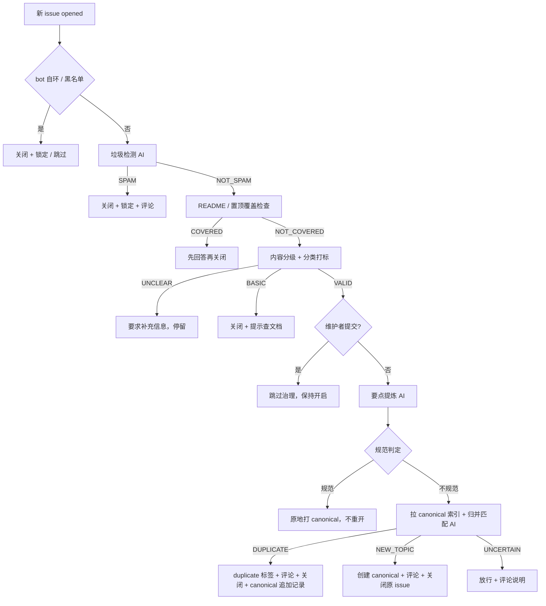

# AI Issue Governance

GitHub Action：把 NoMore Spam 改造成面向本仓库（workbuddy2api）的 **AI Issue 治理** action——
在保留上游「垃圾检测 / README 覆盖 / 内容分级」能力的基础上，新增**要点提炼 + canonical 归并 + 规范化重开**。

> 上游：<https://github.com/JohnsonRan/nomore-spam>（MIT，本目录 `LICENSE` 保留其版权声明）。
> 本目录代码为本地 composite action（`uses: ./.github/actions/ai-governance`），不是发布到 Marketplace 的第三方 action。

## 它解决什么问题

用户提的 issue 普遍不规范：描述混乱、一条 issue 混多个诉求、重复提需求。Issue Forms 模板挡不住低质量内容。本 action 做的事：

1. **垃圾检测**（保留上游）：SPAM → 关闭 + 锁定 + 评论说明。
2. **要点提炼**：AI 抽出「要点 + 要做的事」，中文结构化摘要。
3. **归并匹配**：拉取带 `canonical` 标签的 issue 列表造索引（编号 + 标题 + 正文摘要），AI 判断新 issue 是否与某条 canonical 重复/高度相关。
   - 匹配成功 → 新 issue 评论（要点 + canonical 链接）+ `duplicate` 标签 + 关闭，并向 canonical 追加「归并记录」。
   - 无匹配 → AI 生成规范化新 issue（`[Feature]`/`[Bug]` 前缀 + 背景与要点 + 期望行为），创建并打 `canonical` + 分类标签，原 issue 评论 + 关闭。
4. **质量分级边界**：已规范的 issue 不重开，原地打 `canonical`。
5. **PR 治理**：默认关闭（`enable-pr-governance: true`）。开启后 PR 打开时走同一套「整理 + 关联」：
   - 保留上游垃圾 / 质量检测（SPAM/恶意/trivial → 关闭，这是**唯一会关 PR 的路径**）；标题不规范的 PR
     （`INVALID_COMMIT`）不再关闭，而是流入治理「规范化改写标题」；
   - AI 提炼 PR 要点 → 匹配 canonical（复用 issue 治理的提炼/匹配/起草）→ 评论 + 规范化标题 + 正文顶部追加关联块；
   - 匹配成功关联 `Related to #N`；无匹配则创建新 canonical，正文追加 `Closes #N`；
   - **PR 治理永不关闭合法 PR**，正文追加带幂等锚点（`<!-- ai-governance:linked -->`）防重跑叠加。

## 安全阀（设计要点）

| 安全阀 | 行为 |
|--------|------|
| **dry-run** | 默认 `true`：只评论「本应执行什么」，不关闭、不创建、不打标签 |
| **维护者豁免** | 仓库协作者提交的 issue/PR 跳过治理（只做垃圾检测 + 分类） |
| **AI 失败不误关** | 任何 AI 调用失败 → 只评论「已放行」+ 保持开启；**宁可漏判，不可误关** |
| **先建后关** | 新主题时先创建 canonical，成功后才关闭原 issue；创建失败绝不关闭 |
| **UNCERTAIN 放行** | 归并匹配证据不足时放行，仅评论，由维护者人工判断 |
| **bot 自环防护** | 跳过 `github-actions[bot]` 自身 issue/PR，避免治理自己创建的 canonical 造成死循环 |
| **PR 永不因治理被关** | PR 治理只评论/改写标题/追加正文，唯一关闭出口是上游垃圾/恶意/trivial 检测 |

## 使用

### 1. workflow 示例

`.github/workflows/ai-governance.yml`（本仓库已提供）：

```yaml
name: AI Governance

on:
  issues:
    types: [opened]
  # PR 治理：pull_request_target 让 action 以目标仓库身份运行，获得改写 PR 标题/正文的写权限
  # （安全设计见 DESIGN.md §12：本地 action、不 checkout fork 分支、token 不外泄）
  pull_request_target:
    types: [opened]

permissions:
  contents: read
  issues: write
  pull-requests: write     # PR 治理改写标题 / 追加正文需要
  models: read             # 仅走 GitHub Models 时需要

jobs:
  governance:
    runs-on: ubuntu-latest
    steps:
      - uses: actions/checkout@v4
      - uses: ./.github/actions/ai-governance
        with:
          github-token: ${{ github.token }}
          ai-base-url: ${{ secrets.AI_BASE_URL }}
          ai-api-key: ${{ secrets.AI_API_KEY }}
          ai-model: ${{ secrets.AI_MODEL }}
          labels: 'bug,enhancement,question,documentation'
          language: zh-CN
          dry-run: 'true'
          enable-pr-governance: 'true'
```

### 2. 配置项

| input | 默认 | 说明 |
|-------|------|------|
| `github-token` | `${{ github.token }}` | issues:write 足够；PR 治理改写标题/正文需 pull-requests:write；走 GitHub Models 还需 models:read |
| `ai-model` | `openai/gpt-4o` | 模型名（`AI_MODEL` secret 可覆盖） |
| `ai-base-url` | 空 | 自定义 OpenAI 兼容 base URL；缺省回落 GitHub Models |
| `ai-api-key` | 空 | 自定义 API key；缺省用 GitHub token |
| `ai-api-type` | `chat-completions` | `chat-completions` 或 `responses` |
| `labels` | `bug,enhancement,question,documentation` | 分类标签（对齐仓库 label） |
| `language` | `zh-CN` | 机器人评论语言 |
| `blacklist` | 空 | 逗号分隔自动关闭黑名单 |
| `canonical-label` | `canonical` | 归并目标标记标签 |
| `duplicate-label` | `duplicate` | 重复 issue 标签 |
| `dry-run` | `true` | 演练模式（只评论） |
| `maintainer-exempt` | `true` | 维护者豁免 |
| `enable-pr-governance` | `false` | PR 治理开关（垃圾检测 + 要点提炼 + canonical 关联，永不关闭合法 PR） |
| `max-canonical-index` | `50` | canonical 索引上限 |
| `canonical-body-truncate` | `1500` | 索引正文截断长度 |

### 3. Secrets

- `AI_MODEL` / `AI_BASE_URL` / `AI_API_KEY`：可选，自定义 AI 端点。**缺省三者都可以不配**——action 回落到 GitHub Models（用 `github.token` 做鉴权，靠 workflow 的 `models: read` 权限）。
- 标签 `canonical` 与 `duplicate` 需在仓库 `Settings > Labels` 里预先建好（`canonical` 不存在时归并匹配退化：找不到索引 → 视为新主题，不会报错）。

### 4. 行为流程



## 开发

```bash
cd .github/actions/ai-governance
npm ci
npm test          # jest，治理服务 mock github + ai
npm run lint      # eslint
```

代码在 `src/` 下，issue 治理逻辑在 `src/services/issueGovernanceService.js` 与 `src/handlers/issueHandler.js`；
PR 治理逻辑在 `src/services/prGovernanceService.js` 与 `src/handlers/prHandler.js`（复用 issue 治理的提炼/匹配/起草，不复制粘贴）；
上游复用模块（`ai.js`、`github.js`、`issueAnalyzer.js`、`templateDetector.js`、`classificationService.js`、`issueWorkflowService.js` 等）保持不变。

## 目录结构

```
.github/actions/ai-governance/
├── action.yml                 # composite action 定义（inputs 含治理参数）
├── DESIGN.md                  # 设计文档（选型论证 / AI 链路 / 降级 / 安全阀）
├── README.md                  # 本文档
├── config.json                # prompts / responses / logging / defaults（上游 + 治理扩展）
├── LICENSE                    # MIT（保留上游版权）
├── locales/{en,zh-CN}.json    # 评论模板（zh-CN 扩展治理评论）
├── src/
│   ├── index.js               # 入口 + 参数接线
│   ├── handlers/              # issueHandler / prHandler（治理接线）/ issueProcessor
│   ├── services/              # issueGovernanceService + prGovernanceService（新增）+ 上游复用模块
│   └── utils/                 # config / constants / helpers / errors
└── tests/                     # jest（含 governanceService.test.js / prGovernanceService.test.js / prHandler.test.js）
```